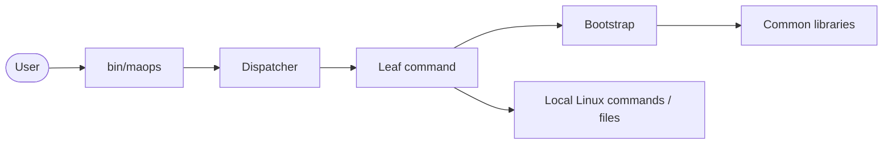
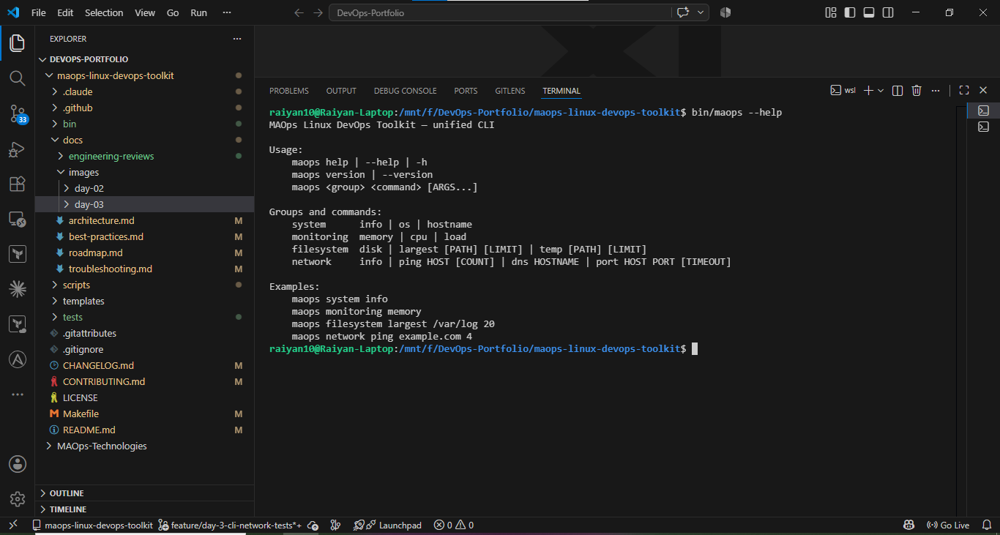
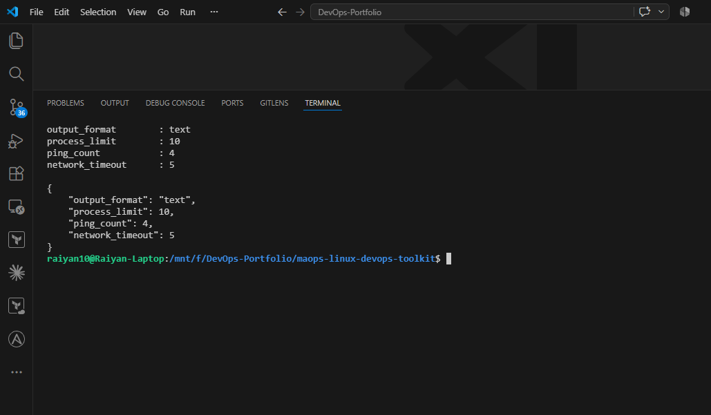
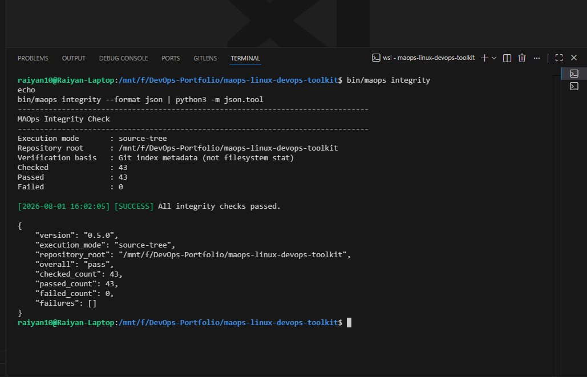
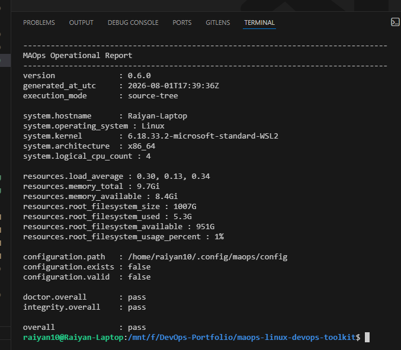
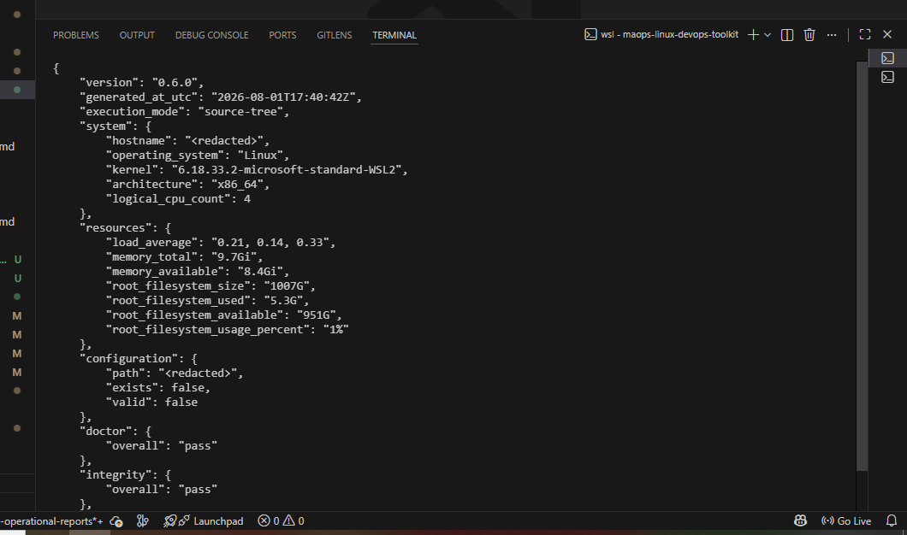
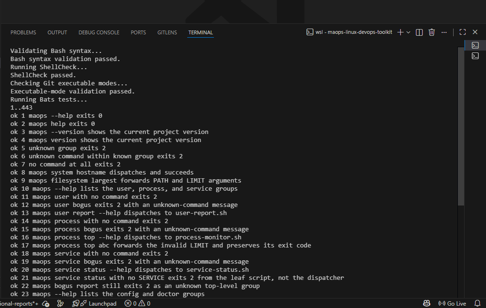

# MAOps Linux DevOps Toolkit

> A production-inspired Linux automation toolkit for DevOps, Platform Engineering and Cloud Operations.


[](https://github.com/raiyan10/maops-linux-devops-toolkit/actions/workflows/bash-validation.yml)


**Status: stable `v1.0.0` release.** Unified CLI, full documentation set,
517 deterministic Bats tests, and a supply-chain-hardened CI/release
pipeline. See [CHANGELOG.md](CHANGELOG.md) for the complete release
history and [docs/roadmap.md](docs/roadmap.md) for what's deliberately
still ahead.

---

# Overview

The **MAOps Linux DevOps Toolkit** is a collection of reusable Bash utilities designed to automate common Linux administration and DevOps tasks.

Unlike simple collections of Linux commands, this project follows production-inspired engineering practices including modular scripting, centralized logging, reusable helper libraries, documentation, testing, and CI/CD.

This repository is part of the **MAOps Technologies Engineering Portfolio**.

---

# Objectives

- Learn Linux automation
- Practice production-quality Bash scripting
- Build reusable DevOps tools
- Apply Infrastructure Automation principles
- Demonstrate Platform Engineering practices
- Build an interview-ready GitHub portfolio

---

# Features

- Modular Bash scripts
- Shared logging library
- Configuration management
- Error handling
- Input validation
- Colored console output
- Documentation
- GitHub Actions
- Claude Code integration
- Production-inspired project structure

---

# Repository Structure

```text
.
├── bin
│   └── maops                       # unified CLI entry point
├── docs
│   ├── architecture.md              # system design, Mermaid diagrams
│   ├── best-practices.md            # engineering conventions and rationale
│   ├── compatibility.md             # supported/unsupported environments
│   ├── demo-workflow.md             # sandboxed copy/paste walkthrough
│   ├── install-from-release.md      # installing from a release tarball
│   ├── portfolio-case-study.md      # engineering write-up
│   ├── quickstart.md                # fastest path to a working install
│   ├── roadmap.md                   # completed vs. post-v1.0 possibilities
│   ├── troubleshooting.md           # symptom-first fixes
│   ├── engineering-reviews/         # per-day release-readiness reviews (dev-only)
│   └── images/                      # per-day screenshots (day-02 .. day-07)
├── examples
│   ├── README.md
│   ├── config/maops.conf            # example, validated configuration
│   └── automation/health-report.sh  # example automation script
├── scripts
│   ├── common/                      # bootstrap + shared libraries
│   ├── config/                      # config-manager.sh
│   ├── diagnostics/                 # doctor.sh, integrity-check.sh
│   ├── filesystem/                  # disk-usage, largest-files, cleanup-temp
│   ├── install/                     # install.sh, uninstall.sh
│   ├── monitoring/                  # cpu, memory, load
│   ├── network/                     # info, ping, dns, port
│   ├── process/                     # process-monitor.sh
│   ├── release/                     # package.sh, verify-package.sh, validate-documentation.sh
│   ├── reports/                     # operational-report.sh
│   ├── service/                     # service-status.sh
│   ├── system/                      # system-info, os-details, hostname-report
│   └── users/                       # user-report.sh
├── templates
│   └── script-template.sh           # canonical pattern for a new leaf script
├── tests                            # one .bats file per scripts/ module (see Testing)
├── .github/workflows/bash-validation.yml
├── CHANGELOG.md
├── CONTRIBUTING.md
├── LICENSE
├── Makefile
├── README.md
├── SECURITY.md
└── SUPPORT.md
```

`dist/` (generated release artifacts from `make package`) is gitignored and
intentionally not shown above. `.claude/` (Claude Code project guidance,
used for development only) is likewise omitted here — see
[CONTRIBUTING.md](CONTRIBUTING.md) for the actual development workflow.

---

# Utilities

## Implemented

### System (`scripts/system`)

- [x] System Information — `system-info.sh`
- [x] OS Details — `os-details.sh`
- [x] Hostname Report — `hostname-report.sh`

### Monitoring (`scripts/monitoring`)

- [x] CPU Monitor — `cpu-monitor.sh`
- [x] Memory Report — `memory-report.sh`
- [x] Load Average — `load-average.sh`

### Filesystem (`scripts/filesystem`)

- [x] Disk Usage — `disk-usage.sh`
- [x] Largest Files — `largest-files.sh`
- [x] Temporary File Cleanup (dry-run scanner, no deletion) — `cleanup-temp.sh`

### Network (`scripts/network`)

- [x] Network Information — `network-info.sh`
- [x] Ping Checker — `ping-check.sh`
- [x] DNS Lookup — `dns-lookup.sh`
- [x] Port Checker — `port-check.sh`

### Users (`scripts/users`)

- [x] User Report (read-only: username, UID, primary GID, home directory, login shell, group memberships, active-session status) — `user-report.sh`

### Process (`scripts/process`)

- [x] Top Processes by CPU or Memory (read-only) — `process-monitor.sh`

### Service (`scripts/service`)

- [x] Service Status (read-only; `systemctl` with a `service(8)` fallback) — `service-status.sh`

### Configuration (`scripts/config`, `scripts/common/config-file.sh`)

- [x] Config path/init/show/validate, with CLI-argument → `MAOPS_*` env var → config-file → built-in-default precedence — `config-manager.sh`

### Diagnostics (`scripts/diagnostics`)

- [x] Environment/health check — toolkit version, execution mode, OS, Bash version, config state, required/optional command availability (read-only, no network calls) — `doctor.sh`
- [x] Integrity verification — installed-tree-vs-manifest or source-tree-vs-Git-index, read-only, never repairs — `integrity-check.sh`

### Installation and Packaging (`scripts/install`, `scripts/release`)

- [x] User-local install/uninstall with a staged, manifest-based runtime tree, supporting both a Git checkout and an extracted release archive as the install source — `install.sh`, `uninstall.sh`
- [x] Reproducible release tarball, Git-index-derived file modes, an internal per-file integrity manifest, and hardened archive-member/checksum verification — `package.sh`, `verify-package.sh`

### Reporting (`scripts/reports`, `scripts/common/reporting.sh`)

- [x] Operational report — version, execution mode, system/resource facts, config state, and doctor/integrity verdicts, in text or JSON, with `--redact` and secure atomic file saving (read-only, no network calls) — `operational-report.sh`

All utilities above are also reachable through the unified [`maops` CLI](#cli-usage) at `bin/maops`.

## Planned

- [ ] Last Login Report (historical login history, e.g. via `last`/`lastlog` — distinct from the current-session check in `user-report.sh`)

---

# Architecture

`bin/maops` is a thin dispatcher: it resolves its own location, sources a
fixed-order bootstrap chain of shared common libraries, and `exec`s
straight into the matching leaf script — so the leaf script's own exit
code becomes the CLI's exit code, with no wrapper process in between.



See [docs/architecture.md](docs/architecture.md) for the full design,
including the distribution/integrity-chain and configuration-precedence
diagrams.

---

# Quickstart

```bash
git clone https://github.com/raiyan10/maops-linux-devops-toolkit.git
cd maops-linux-devops-toolkit

./bin/maops --version
./bin/maops doctor
./bin/maops report summary
```

See [docs/quickstart.md](docs/quickstart.md) for the complete walkthrough
(install, config init, doctor, integrity, text/JSON/redacted reports,
uninstall) and [docs/demo-workflow.md](docs/demo-workflow.md) for the same
walkthrough fully sandboxed in a temporary `$HOME`.

---

# CLI Usage

`bin/maops` is a thin dispatcher over the scripts above — it does not reimplement their logic.

```bash
maops --help
maops --version

maops system info
maops system os
maops system hostname

maops monitoring memory
maops monitoring cpu
maops monitoring load

maops filesystem disk
maops filesystem largest /var/log 20
maops filesystem temp /tmp 30

maops network info
maops network ping example.com 4
maops network dns example.com
maops network port example.com 443 2

maops user report
maops user report alice

maops process top
maops process top 5 cpu
maops process top 15 memory

maops service status cron

maops config path
maops config init
maops config show
maops config show --format json

maops doctor
maops doctor --format json

maops integrity
maops integrity --format json

maops report summary
maops report summary --format json
maops report summary --redact
maops report save --output /tmp/report.json --format json
maops report save --output /tmp/report.json --format json --force
```

Unknown groups or commands print an actionable error and exit with status `2`. Every dispatched command exits with that underlying script's own exit code.

---

# Installation

`maops` defaults to a **user-local** install — never `sudo`, never system-wide by default:

```bash
make install                                    # installs to $HOME/.local
make install PREFIX=/opt/maops                  # or any custom prefix
make install INSTALL_ARGS="--force"             # reinstall/upgrade over an existing install
make uninstall                                  # removes it again
make uninstall UNINSTALL_ARGS="--purge-config"  # also remove the configuration directory
```

Default layout under `PREFIX` (`$HOME/.local` unless overridden):

```text
PREFIX/bin/maops                  -> ../lib/maops/bin/maops   (relative symlink)
PREFIX/lib/maops/bin/maops
PREFIX/lib/maops/scripts/
PREFIX/lib/maops/LICENSE
PREFIX/lib/maops/CHANGELOG.md
PREFIX/lib/maops/.install-manifest
PREFIX/lib/maops/.integrity-manifest
```

Install stages the whole runtime tree in a temporary directory under `PREFIX/lib` before ever replacing anything, refuses to overwrite an unrelated file it finds at `PREFIX/bin/maops` (even with `--force`), and records every installed path in `.install-manifest` so `uninstall.sh` only ever removes files it verifiably owns — scoped to `PREFIX/lib/maops` specifically, never a sibling directory under a shared `PREFIX`. Re-running install over an existing MAOps installation requires `--force`; your configuration file (outside `PREFIX` entirely) is untouched by both install and uninstall unless you pass `--purge-config` to uninstall. Install works both from a Git checkout and from an already-extracted release archive (verifying `MAOPS-MANIFEST.tsv` before copying anything in the latter case) — every installed file's permission mode is derived from Git's index or the package manifest, never from the source filesystem's own `stat` (relevant on WSL/drvfs, where `stat` misreports tracked-file permissions). See [docs/architecture.md §11](docs/architecture.md#11-installation-and-runtime-layout) for the full design and threat model.

---

# Configuration

Config lives at `${MAOPS_CONFIG_FILE:-${XDG_CONFIG_HOME:-$HOME/.config}/maops/config}` — a plain `key=value` text file, never sourced or evaluated as Bash:

```bash
maops config init            # create a default config file
maops config show            # show effective values (after precedence)
maops config validate        # validate the resolved config file
```

Supported keys: `output_format` (`text`/`json`), `process_limit`, `ping_count`, `network_timeout`. Precedence for every value is **explicit CLI argument → `MAOPS_*` environment variable → config file → built-in default**. See [docs/architecture.md §12](docs/architecture.md#12-configuration-system) for the parsing/validation rules and [docs/troubleshooting.md](docs/troubleshooting.md) for common config-rejection causes.

---

# Doctor

`maops doctor` reports toolkit version, source-tree-vs-installed execution mode, OS, Bash version, config state, and the availability of every required runtime command and optional development tool — read-only, no network calls:

```bash
maops doctor
maops doctor --format json | python3 -m json.tool
```

Exits `0` when every required check passes, `1` if a required command or an existing-but-invalid config fails. Missing optional development tools (`git`, `make`, `shellcheck`, `bats`, `python3`) are warnings, never failures. See [docs/architecture.md §14](docs/architecture.md#14-doctor-command) for the full check list.

---

# Integrity

`maops integrity` is a read-only, never-repairing check that verifies what's actually on disk against what it's supposed to be — an installed tree against `PREFIX/lib/maops/.integrity-manifest`, or a source-tree checkout directly against Git's tracked index (never against working-tree `stat`, which is not trustworthy on WSL/drvfs):

```bash
maops integrity
maops integrity --format json | python3 -m json.tool
```

Exits `0` when every file matches, `1` if any file is missing, has modified content, has an unexpected mode, or the manifest itself is malformed — or if neither an installed manifest nor Git metadata is available at all. `maops integrity` never modifies or repairs anything; see [docs/architecture.md §16](docs/architecture.md#16-integrity-verification-maops-integrity) for the full verification model and [docs/troubleshooting.md §17](docs/troubleshooting.md#17-interpreting-a-maops-integrity-failure) for how to interpret a failure.

---

# Report

`maops report summary` consolidates toolkit version, execution mode, system/resource facts (hostname, OS, kernel, architecture, CPU count, load average, memory, root filesystem usage), configuration state, and the `doctor`/`integrity` verdicts into one document — read-only, no network calls, no passwords/environment dumps/process command lines/usernames/IP addresses/config-file contents ever collected:

```bash
maops report summary
maops report summary --format json | python3 -m json.tool
maops report summary --redact
maops report save --output /tmp/report.json --format json
maops report save --output /tmp/report.json --format json --force
```

Exits `0` when doctor/integrity pass and every field is collected, `1` when either fails or only optional system/resource info is unavailable (the report is still emitted in full either way), `2` for a CLI usage error. `--redact` replaces `hostname` and `configuration.path` with `<redacted>`. `report save --output PATH` requires the parent directory to already exist, refuses to overwrite an existing file without `--force`, refuses a symlink target even with `--force`, and writes atomically (a same-directory temp file, mode `0600`, then an atomic rename) so a saved report is never partially written. See [docs/architecture.md §17](docs/architecture.md#17-operational-report-maops-report) for the full field schema and [docs/troubleshooting.md](docs/troubleshooting.md) for how to interpret a failure.

---

# Security and Privacy Model

MAOps is read-only by default — the only code paths that intentionally
write anything are `install.sh`/`uninstall.sh`, `config init`, and `report
save`. No command ever makes a network request. `report`'s `--redact`
flag strips hostname and configuration-path before rendering, and every
saved report is written atomically at mode `0600`.

Integrity verification (external SHA-256 + internal `MAOPS-MANIFEST.tsv`)
proves an archive or installed tree matches what was built — it does not,
on its own, prove who published it, since there is no cryptographic
publisher-identity signing yet. See [SECURITY.md](SECURITY.md) for the
full policy, scope, and how to report a suspected vulnerability.

---

# User, Process, and Service Utilities

These three modules are strictly read-only — none of them ever starts, stops, restarts, enables, disables, kills, or renices anything, and none require `sudo`.

```bash
# Read-only account report: username, UID, primary GID, home directory,
# login shell, group memberships, active-session status. USERNAME is
# optional and defaults to the current effective user.
./scripts/users/user-report.sh
./scripts/users/user-report.sh alice

# Top-N processes by CPU (default) or memory. LIMIT defaults to 10.
./scripts/process/process-monitor.sh
./scripts/process/process-monitor.sh 5 cpu
./scripts/process/process-monitor.sh 15 memory

# Read-only service status. Prefers systemctl when systemd is genuinely the
# running init system, falls back to the service(8) command otherwise.
./scripts/service/service-status.sh cron
```

See [docs/architecture.md §9](docs/architecture.md#9-user-process-and-service-modules) for tool choices and the service-manager detection strategy, and [docs/best-practices.md §12–§15](docs/best-practices.md#12-read-only-operations-by-default) for the read-only, detection/fallback, test-stub, and exit-code conventions these modules establish.

---

# Network Utilities

```bash
# Hostname, interfaces, IPv4 addresses, default gateway, DNS resolvers
./scripts/network/network-info.sh

# Ping a host with a bounded, safe-default packet count
./scripts/network/ping-check.sh example.com
./scripts/network/ping-check.sh example.com 6

# Resolve a hostname or IP using the system resolver (getent)
./scripts/network/dns-lookup.sh localhost
./scripts/network/dns-lookup.sh example.com

# Check TCP port reachability with a bounded connection timeout
./scripts/network/port-check.sh example.com 443
./scripts/network/port-check.sh example.com 443 2
```

---

# Testing

The test suite uses [Bats](https://github.com/bats-core/bats-core) and requires no internet access — every network-related test either validates rejected input before any connection is attempted, or stays on loopback/`/etc/hosts`. As of v1.0.0 the suite has **517 deterministic tests** across 20 files (one per `scripts/` module), all offline and independent of the host's real state.

```bash
make test      # run the full Bats suite
make quality   # syntax validation + ShellCheck + executable-mode check + Bats
```

Individual files can also be run directly, e.g. `bats tests/cli/maops.bats`.

Release and install-specific checks are separate, filesystem-heavier targets not folded into `make quality`:

```bash
make package         # build dist/*.tar.gz and its .sha256 checksum
make verify-package  # verify the checksum, archive-member safety, and internal manifest
make smoke-install   # install to a temporary prefix, run the CLI + doctor + integrity, then uninstall
make integrity       # run `maops integrity` against the source tree
make docs-check      # offline documentation validation (scripts/release/validate-documentation.sh)
make examples-check  # validate examples/ (config + bash -n/ShellCheck + example Bats tests)
make release-check   # quality -> package -> verify-package -> smoke-install, in order
make final-check     # release-check -> docs-check -> examples-check -> report-json -> integrity
```

`make final-check` is the single command CI runs on every push and pull
request to `main` (`.github/workflows/bash-validation.yml`) — reproduce it
locally with `make clean final-check` for a fully fresh run before pushing.

---

# Compatibility

Actively validated: **Ubuntu (`ubuntu-latest` on GitHub Actions)** and
**WSL2 Ubuntu** (the author's development environment). Other
Debian/Ubuntu-family systemd distributions are expected to work but are
not continuously tested. Alpine/BusyBox/musl and macOS/BSD are not
supported. Bash ≥ 4 is required; Python 3 is needed only for
release/development tooling, never for ordinary `maops` commands. See
[docs/compatibility.md](docs/compatibility.md) for the full breakdown and
the evidence behind each claim.

---

# Engineering Principles

This project follows:

- Infrastructure as Code
- Automation First
- Documentation as Code
- Reusable Components
- Secure by Design
- Production-inspired Engineering

---

# Technology Stack

- Linux
- Bash
- Git
- GitHub Actions
- ShellCheck
- shfmt
- Claude Code

---

# Roadmap

- [x] Common utility library
- [x] Logging framework
- [x] Output framework
- [x] System utilities
- [x] Initial monitoring utilities
- [x] Initial filesystem utilities
- [x] Bash syntax validation
- [x] ShellCheck integration
- [x] GitHub Actions CI
- [x] Claude Code project guidance
- [x] Claude Code Skills
- [x] Git executable-mode and SIGPIPE release-blocker fixes (Engineering Review Day 2)
- [x] Unified `maops` CLI
- [x] Network utilities
- [x] Bats automated tests
- [x] User, process, and service utilities
- [x] Configuration system with precedence resolution and JSON output
- [x] Doctor diagnostic command
- [x] Installation and packaging
- [x] Release integrity hardening (Git-index mode normalization, internal release manifest, hardened archive verification, `maops integrity`)
- [x] Operational report command (`maops report summary|save`, text/JSON, redaction, atomic file saving)
- [x] Architecture diagrams (Mermaid: runtime, distribution/integrity chain, config precedence)
- [x] Final CLI-consistency audit and remaining Day 7 findings closed
- [x] Full v1 documentation set, examples, and offline documentation validation
- [x] v1.0.0 stable release
- [ ] Medium technical article
- [ ] Publisher authenticity / archive signing (see [docs/roadmap.md](docs/roadmap.md))

See [docs/roadmap.md](docs/roadmap.md) for the detailed, module-level roadmap.

---

# Screenshots

A few representative screenshots from across the project's development —
the full per-day set lives under `docs/images/`.

| CLI Help | Config (text/JSON) | Integrity Check |
|---|---|---|
|  |  |  |

| Operational Report | Redacted JSON Report | 443+ Passing Tests |
|---|---|---|
|  |  |  |

---

# Documentation

| Document | Purpose |
|---|---|
| [docs/quickstart.md](docs/quickstart.md) | Fastest path from a clone to a working, verified install |
| [docs/install-from-release.md](docs/install-from-release.md) | Installing from a downloaded release tarball |
| [docs/compatibility.md](docs/compatibility.md) | Supported, expected, and unsupported environments |
| [docs/demo-workflow.md](docs/demo-workflow.md) | Fully sandboxed copy/paste demo |
| [docs/portfolio-case-study.md](docs/portfolio-case-study.md) | Engineering write-up: problem, architecture, lessons |
| [docs/architecture.md](docs/architecture.md) | System design, with Mermaid diagrams |
| [docs/best-practices.md](docs/best-practices.md) | Engineering conventions and the rationale behind them |
| [docs/troubleshooting.md](docs/troubleshooting.md) | Symptom-first fixes |
| [docs/roadmap.md](docs/roadmap.md) | Completed-in-v1.0.0 vs. post-v1.0 possibilities |
| [examples/README.md](examples/README.md) | Example configuration and automation script |
| [CONTRIBUTING.md](CONTRIBUTING.md) | Development environment and contribution workflow |
| [SECURITY.md](SECURITY.md) | Vulnerability reporting and the integrity trust boundary |
| [SUPPORT.md](SUPPORT.md) | Getting help, supported use cases and environments |
| [CHANGELOG.md](CHANGELOG.md) | Complete release history |

---

# Future Improvements

- Docker Support
- Kubernetes Diagnostics
- Remote Server Automation
- Ansible Integration
- AWS CLI Automation
- Azure CLI Automation
- Security Hardening Scripts

---

# Related Projects

This project is part of the MAOps Technologies Engineering Portfolio.

- Enterprise DevOps Platform
- Docker Platform
- Kubernetes Platform
- DevSecOps
- GitHub Actions
- Terraform AWS
- Terraform Azure
- MLOps
- LLMOps
- RAG Platform
- AIOps
- AI Infrastructure

---

# Contributing, Security, and Support

- **Contributing:** see [CONTRIBUTING.md](CONTRIBUTING.md) for the
  development environment, quality gates, and branch-naming conventions.
- **Security:** see [SECURITY.md](SECURITY.md) to report a suspected
  vulnerability, and for the integrity-vs-publisher-authenticity
  trust boundary.
- **Support:** see [SUPPORT.md](SUPPORT.md) for supported use cases,
  tested environments, and what to include in an issue report.

---

# License

MIT License